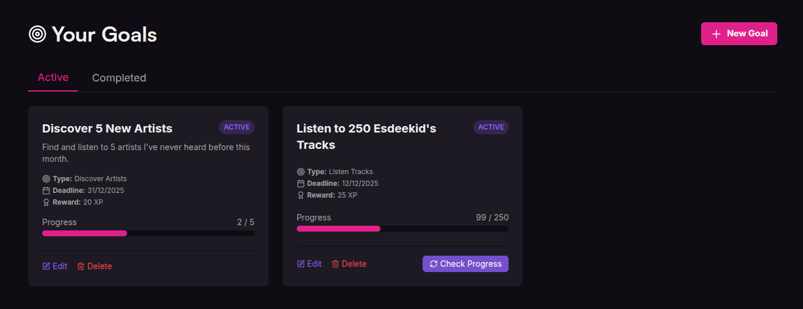
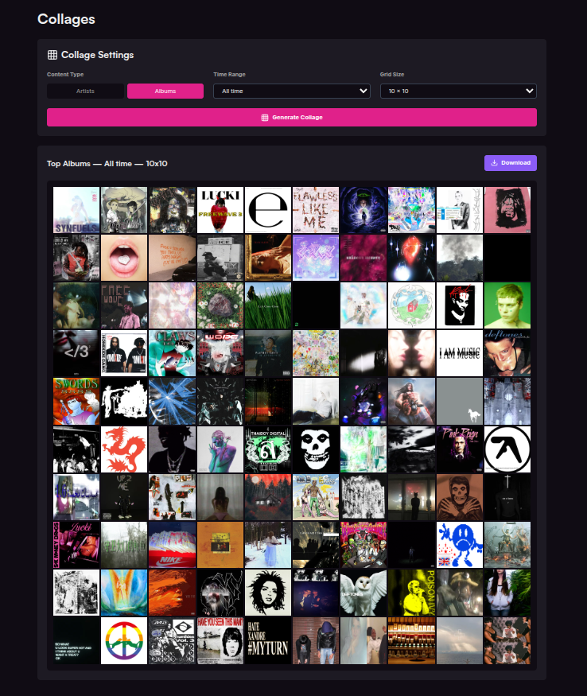
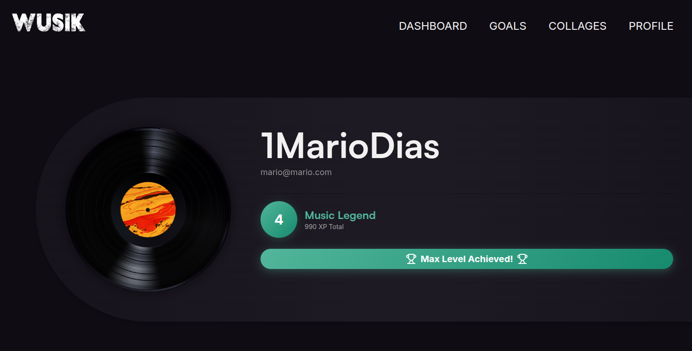

<p align="center">
  
</p>

<h1 align="center">WUSIK - Gamified Music Tracker</h1>

<p align="center">
  <strong>Track your music, compete for crowns, achieve goals, and showcase your taste</strong>
</p>

<p align="center">
  
  
  
  
</p>

---

## 📖 About

**WUSIK** is a modern, gamified Single Page Application (SPA) that transforms your music listening habits into an interactive experience. Built with Vue 3, it seamlessly integrates with Last.fm and Spotify APIs to provide comprehensive music statistics, competitive features, and personalized visual content.

Whether you're discovering new artists, competing with friends for artist crowns, or creating beautiful collages of your top tracks, WUSIK turns passive listening into an engaging journey.

---

## ✨ Key Features

### 🎧 Dashboard - Your Music Hub


Monitor your musical activity in real-time with:
- **Recently Listened Tracks**: View your last 35 scrobbles with album art and timestamps
- **Top Artists**: Discover your most played artists across different time periods (week, month, quarter, year, all-time)
- **Crown Run**: Scan and compete for artist crowns against other users
- **Paginated Views**: Navigate through your extensive listening history
- **Spotify Integration**: Enhanced artist images from Spotify API

---

### 🎯 Goals - Track Your Progress


Set and achieve personalized music goals:
- **Three Goal Types**:
  - 🎵 **Listen to Artist Tracks**: Reach specific playcount milestones for your favorite artists
  - 👑 **Earn Crowns**: Compete to become the #1 listener for multiple artists
  - 🔍 **Discover New Artists**: Expand your musical horizons (manual tracking)
- **Automated Progress Tracking**: Real-time updates for listening and crown goals via Last.fm API
- **XP Rewards System**: Earn experience points based on goal difficulty
  - 100 plays = 10 XP
  - 250 plays = 25 XP
  - 500 plays = 60 XP
  - 5 crowns = 20 XP
  - 10 crowns = 50 XP
  - 20 crowns = 120 XP
- **Deadline Management**: Set custom completion dates
- **Visual Progress Bars**: Track your advancement at a glance
- **Goal Templates**: Choose from pre-configured goal types with different difficulty levels

---

### 🖼️ Collages - Visualize Your Taste


Create stunning visual representations of your music:
- **Content Types**: Generate collages for artists or albums
- **Time Ranges**: Last week, month, quarter, year, or all-time
- **Grid Sizes**: 
  - 3x3 (9 items)
  - 5x5 (25 items)
  - 10x10 (100 items)
- **High-Quality Images**: Album artwork from Last.fm
- **Hover Details**: View play counts and rankings on hover
- **Download Feature**: Export your collages as PNG files
- **Responsive Design**: Perfect layout on any device

---

### 👤 Profile - Your Musical Identity


Showcase your achievements and progress:
- **Level System**: 5 progression tiers with dynamic color schemes
  - Level 0: **Novice Listener** (0-199 XP) - Deep Red
  - Level 1: **Casual Fan** (200-399 XP) - Burnt Orange
  - Level 2: **Music Enthusiast** (400-599 XP) - Medium Orange
  - Level 3: **Audiophile** (600-799 XP) - Golden Yellow
  - Level 4: **Music Legend** (800+ XP) - Turquoise
- **XP Progress Bar**: Visual representation of your journey to the next level
- **Gradient Badges**: Color-coded level indicators
- **User Stats**: Display total XP and current level
- **Achievement Tracking**: Monitor your overall progress

---

### 👑 Crown Competition
Compete with other WUSIK users to become the ultimate fan:
- **Crown Scanning**: Analyze top 50 artists against all registered users
- **Automatic Updates**: Real-time crown redistribution based on play counts
- **XP Rewards**: Earn 5 XP for each crown gained
- **Crown Gallery**: View all your claimed artist crowns with pagination
- **Competitive Leaderboards**: See who holds the most crowns

---

## 🛠️ Tech Stack

### Frontend
- **Vue 3** - Progressive JavaScript framework
- **Vite** - Next-generation build tool
- **Pinia** - Intuitive state management
- **Vue Router** - Official routing library
- **Tailwind CSS** - Utility-first CSS framework

### APIs & Services
- **Last.fm API** - Music metadata and scrobble tracking
- **Spotify Web API** - Enhanced artist imagery
- **json-server** - Mock REST API for user data

### Additional Libraries
- **Axios** - Promise-based HTTP client
- **html2canvas** - Screenshot functionality for collages
- **Lucide Vue** - Beautiful icon system

---

## 🚀 Getting Started

### Prerequisites
- **Node.js** v16 or higher
- **npm** or **yarn**
- **Last.fm API Key** - [Get it here](https://www.last.fm/api/account/create)
- **Spotify API Credentials** - [Register here](https://developer.spotify.com/dashboard)

### Installation

1. **Clone the repository**
   ```bash
   git clone https://github.com/1MarioDias/SpotifyTracker.git
   cd SpotifyTracker
   ```

2. **Install dependencies**
   ```bash
   npm install
   ```

3. **Configure environment variables**
   
   Create a `.env` file in the root directory:
   ```env
   VITE_LASTFM_API_KEY=your_lastfm_api_key
   VITE_SPOTIFY_CLIENT_ID=your_spotify_client_id
   VITE_SPOTIFY_CLIENT_SECRET=your_spotify_client_secret
   ```

4. **Start the mock API server**
   ```bash
   npm run mock-server
   ```
   The server runs on `http://localhost:3000`

5. **Start the development server**
   ```bash
   npm run dev
   ```
   Access the app at `http://localhost:5173`

---


## 🎮 How to Use

### 1. **Register & Connect**
- Create an account with your email and password
- Link your Last.fm username to start tracking

### 2. **Explore Your Dashboard**
- View recently played tracks
- Discover your top artists across different time periods
- Download artist grids as JPEG images

### 3. **Set Goals**
- Navigate to the Goals tab
- Create new goals using templates
- Track progress automatically or manually
- Complete goals to earn XP and level up

### 4. **Compete for Crowns**
- Click "Scan For Crowns" in the Crown Run section
- The system analyzes your top 50 artists
- Crowns are awarded to the user with the highest play count
- Earn 5 XP for each crown gained

### 5. **Generate Collages**
- Choose between artists or albums
- Select a time range and grid size
- Generate and download your personalized collage

### 6. **Level Up**
- Complete goals and earn crowns to gain XP
- Progress through 5 levels
- Track your advancement in your Profile

---

## 🧪 Testing

### Run Tests
```bash
npm run test
```

### Test Coverage
Under Construction

---

## 👥 Contributors

<table>
  <tr>
    <td align="center">
      <a href="https://github.com/1MarioDias">
        <sub><b>Mário Dias</b></sub>
      </a><br />
      <sub>Full Stack Developer</sub>
    </td>
    <td align="center">
      <a href="https://github.com/DSTeles">
        <sub><b>Diana Teles</b></sub>
      </a><br />
      <sub>Full Stack Developer</sub>
    </td>
  </tr>
</table>

---

This project is developed as part of an academic assignment for **LTSIW - Web Technologies** course.

---

<p align="center">
  © 2025 WUSIK - Gamified Music Tracker
</p>
